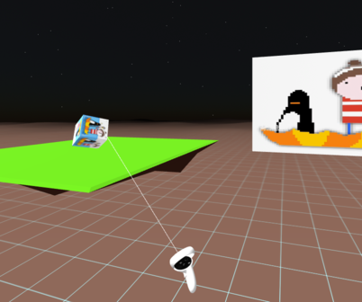

### Exercise #3: Locomotion

# A-Frame simple User Interface

Criação de um ambiente VR interactivo, usando [A-Frame](https://aframe.io) - uma framework web para construção de experiências de realidade virtual.

## Outros

Pixel Art de Jorge Antunes e descrição dos monumentos retirado do site [JMArtsDesign](https://www.pixilart.com/jmartsdesign)

Floating Island by sirkitree (modelo 3D) [[CC-BY](https://creativecommons.org/licenses/by/3.0/)] via [Poly Pizza](https://poly.pizza/m/eEz9hdknXOi)

---

#### MDM/UC - ARVI - Ambientes de Realidade Virtual Interativos 2023

Disponivel no GitHub

Disponivel no [Glith](https://glitch.com/~exercise-3-locomotion-main)
